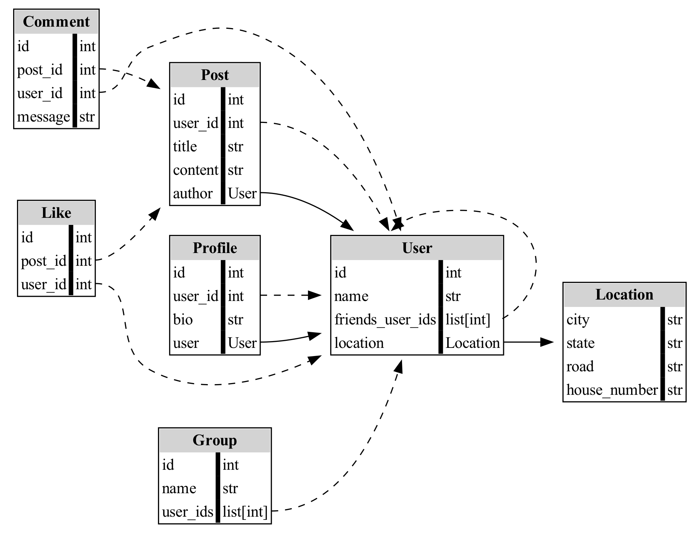

# render_pydantic_relations

Visualize relationships between Pydantic models using Graphviz.

## Relationship Detection Rules

The visualization relies on two conventions to infer relationships between models:

1. **Containment**:  
   If a model has a field whose type is another `BaseModel` (or a generic like `List[BaseModel]`),  
   it is treated as a **contains** relationship (solid line).

2. **Reference by ID**:  
   If a model has a field ending with `_id` or `_ids`, and the prefix matches the lowercase name  
   of another model, it is treated as a **reference** (dashed line).  
   Example: `user_id: int` in `Post` refers to the `User` model.

These heuristics allow automatic detection of nested structures and foreign-key-like references in Pydantic schemas.


## Install

```bash
pip install git+https://github.com/ffhammer/render_pydantic_relations.git
```

## Usage

```python
from render import visualize_relationship
from my_models import User, Order

graph = visualize_relationship([User, Order])
graph.render("out", format="png", cleanup=True)
```

## Example

[example.py](example.py)
